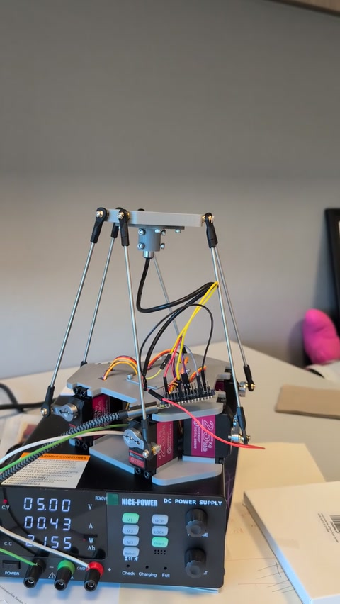
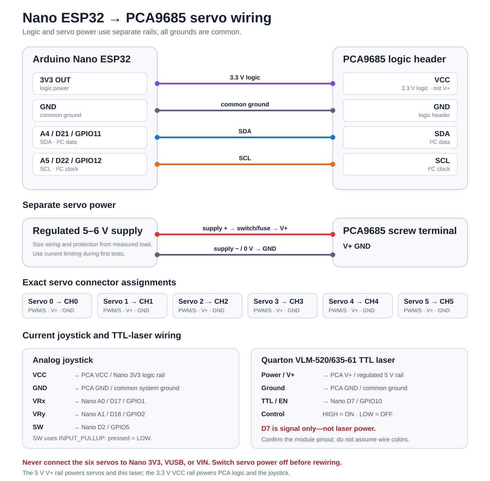

# Servo Stewart Platform

A student-buildable, 3D-printed rotary Stewart platform using six hobby servos, an Arduino Nano ESP32, and a PCA9685 servo driver. The project is being developed as a motion-control and optical-alignment test bed, with optional TTL-controlled laser, joystick, camera, Raspberry Pi, and reinforcement-learning extensions.

This repository is a fork of [Nathan Ge's Stewart platform](https://github.com/nzge/stewart-platform). The mechanical design has been adapted for DS3225 servos and expanded with electronics holders, a laser mount, and camera/Pi mounting parts. This repo contains ChatGPT code and stl files; this README is also made with the help of ChatGPT.


> **Project status:** The current interactive firmware is suitable for serial control of the servos and the platform orientation, as well as manual motion demonstration. Its X/Y and roll/pitch commands are still preliminary - not yet geometrically decoupled six-degree-of-freedom inverse kinematics. The range of motion can be limited until the geometry, servo centers, directions, and mechanical limits have been calibrated. 

## Demonstration video

[](docs/toy-stewart-platform-demo-web.mp4)

*Click the image to play the 19-second demonstration video.*

## Repository links

- [Revision 4 printable parts](https://github.com/qi-feng/stewart-platform/tree/main/cad/stewart-frame_rev4)
- [Arduino Stewart-platform controller](https://github.com/qi-feng/stewart-platform/blob/main/code/arduino-code/stewart_interactive_controller.ino)
- [Inverse-kinematics notebook](https://github.com/qi-feng/stewart-platform/blob/main/stewart_inverse-kinematics.ipynb)
- [Original Nathan Ge project](https://nzge.github.io/projects/stewart-platform.html)

## System overview

The Arduino Nano ESP32 sends I²C commands to the PCA9685. The PCA9685 generates six servo-control signals, while a separate regulated 5–6 V supply powers the servos. The joystick and USB/Wi-Fi console provide manual control. The Raspberry Pi, camera, and laser are optional and are not required for basic platform operation.

## Parts list

### Core electronics

| Qty | Part | Specification or example |
|---:|---|---|
| 6 | Positional digital servos | DS3225 (or similar), 25 kg class, 180° version—not continuous rotation |
| 1 | Microcontroller | [Arduino Nano ESP32 with headers, ABX00083](https://docs.arduino.cc/hardware/nano-esp32/) |
| 1 | Servo driver | [PCA9685 16-channel servo controller](https://www.amazon.com/dp/B07BRS249H) |
| 1 | Servo power supply | Regulated 5–6 V DC supply sized for the combined servo load; adjustable current limiting is useful during commissioning |
| 1 | Master power switch or emergency disconnect | Rated for the supply voltage and expected current |
| 1 | Inline fuse and holder | Select the fuse from the finished system's measured wiring and load requirements; do not automatically copy a 20 A value |
| 1 | Analog joystick with pushbutton | Two analog axes plus an active-low switch |
| 1 | USB-C data cable | For programming and initial Nano power |
| — | Logic and servo-power wiring | 20/22/24 AWG stranded wire or secure pre-crimped connectors |

### Mechanical parts

| Qty | Part | Specification or notes |
|---:|---|---|
| 6 | Aluminum clamping servo horns | 25T spline; approximately 25 mm servo-axis-to-ball-center radius in this build |
| 6 | M3 threaded linkage rods | Cut or adjust to the measured platform geometry |
| 12 | M3 ball-joint rod ends | Two per linkage; RC steering-linkage style |
| 12 | M3 jam nuts | One at each rod end to lock the adjusted linkage length |
| As needed | M3/M4 screws, washers, and nuts | Securing electronics, linkage hardware, and printed parts |
| As needed | M3/M4 heat-set inserts | For printed parts to mount the boards or the linkage rods |
| 1 set | 3D-printed structural parts | Base, base cover, upper platform/adapter, servo links, controller holder, and cover |
| 1 | Filament | PLA is suitable for initial builds; PETG can be used where greater toughness or heat resistance is useful |

All six completed linkages should begin with the same effective ball-center-to-ball-center length. The current prototype measurement is approximately **154 mm**, but builders must measure their own printed geometry rather than treating that value as universal.

### Optional optical and vision system

| Qty | Part | Specification or example |
|---:|---|---|
| 1 | TTL-controlled dot laser | 10 mm diameter × 40 mm length module used by this prototype |
| 1 | Printed laser mounts | Laser holder, camera case, camera stand, and Pi tray from the CAD directories |
| 1 | Camera | Arducam OV5647 5 MP camera with a Raspberry Pi or Xiao eps32s3-sense camera module or similar |
| 1 | Beam stop/enclosure | Non-reflective, mechanically secured, and appropriate for the selected laser class |

The laser and vision hardware are not needed for the initial servo build. Add them only after the platform homes reliably and its mechanical limits have been established.

## Wiring



| Source pin | PCA9685 pin |
|---|---|
| Nano **3V3** | **VCC** |
| Nano **GND** | Logic-header **GND** |
| Nano **A4 / D21 / GPIO11** | **SDA** |
| Nano **A5 / D22 / GPIO12** | **SCL** |
| Servo supply **positive** | Screw-terminal **V+** |
| Servo supply **negative / 0 V** | Screw-terminal **GND** |
| Servo 0 three-wire plug | **CH0:** PWM/S, V+, GND |
| Servo 1 three-wire plug | **CH1:** PWM/S, V+, GND |
| Servo 2 three-wire plug | **CH2:** PWM/S, V+, GND |
| Servo 3 three-wire plug | **CH3:** PWM/S, V+, GND |
| Servo 4 three-wire plug | **CH4:** PWM/S, V+, GND |
| Servo 5 three-wire plug | **CH5:** PWM/S, V+, GND |
| PCA9685 **OE** | Leave unconnected for the basic build |

For each servo plug, connect its signal lead—usually orange, yellow, or white—to `PWM/S`; red to `V+`; and brown or black to `GND`. Follow the labels printed on the PCA9685 rather than assuming the physical row order is identical on every clone.

### Joystick wiring

| Joystick pin | Current project connection |
|---|---|
| VCC | PCA9685 **VCC** header—the same 3.3 V logic rail as Nano **3V3** |
| GND | PCA9685 logic-header **GND**—the common system ground |
| VRx | Nano **A0 / D17 / GPIO1** |
| VRy | Nano **A1 / D18 / GPIO2** |
| SW | Nano **D2 / GPIO5** |

### Current Quarton TTL-laser wiring

| Laser connection | Current project connection |
|---|---|
| Power / V+ | PCA9685 **V+** rail, supplied by the regulated **5 V** servo supply |
| Ground | PCA9685 **GND** / common system ground |
| TTL / EN | Nano **D7 / GPIO10** |

The sketch drives D7 **HIGH** to turn the laser on and **LOW** to turn it off. D7 is only the TTL control signal; it does not power the laser. This mapping is for the prototype's [Quarton VLM-520-61](https://www.quarton.com/green-circular-dot-laser-module-with-ttl-modulation-function-vlm-520-61-series.html) or [VLM-635-61](https://www.quarton.com/red-circular-dot-laser-module-with-ttl-modulation-function-vlm-635-61-series.html), which accept 3–6 V DC power. Verify the manufacturer's pinout rather than relying on wire color, especially when substituting a different module.

### Critical power rules

- `VCC` and `V+` are different. PCA9685 `VCC` receives 3.3 V logic power; `V+` receives the separate 5–6 V servo supply.
- Never power the six servos from the Nano's `3V3`, `VUSB`, or `VIN` pins.
- The Nano, PCA9685, servo supply, joystick, and optional laser-control circuit must share ground.
- Switch servo power off before changing wiring or installing servo horns.
- A breadboard may be used for low-current logic signals, but not for distributing servo power.

## Software setup

1. Install the [Arduino IDE](https://www.arduino.cc/en/software).
2. Install **Arduino ESP32 Boards by Arduino** using Boards Manager.
3. Select **Arduino Nano ESP32**.
4. Install **Adafruit PWM Servo Driver Library** using Library Manager.
5. Open the [Stewart-platform sketch](https://github.com/qi-feng/stewart-platform/blob/main/code/arduino-code/stewart_interactive_controller.ino).
6. Confirm the configured pins, servo directions, servo centers, and pulse limits before applying servo power.
7. Upload through USB-C and open Serial Monitor at **115200 baud**.

If the Wi-Fi-console version of the sketch is used, register the Nano's Wi-Fi MAC address, enter credentials locally without committing them to Git, and connect to the reported address with:

```bash
nc NANO_IP_ADDRESS 2323
```

## First power-on

1. Leave the servo horns disconnected from the linkages.
2. Confirm all six servos are positional 180° models.
3. Power the Nano over USB and verify that the PCA9685 responds at I²C address `0x40`.
4. Set the external servo supply to 5 V and a conservative current limit.
5. Connect and center one servo at a time.
6. Install each 25T horn at its intended neutral orientation while the servo is commanded to center.
7. Disconnect servo power and assemble the linkages.
8. Reapply power with one hand ready at the master disconnect.
9. Test HOME and small roll/pitch commands before selecting larger ranges or running the demonstration.

## Controls

The exact controls depend on the sketch revision. The current interactive development controller uses:

| Input | Action |
|---|---|
| Joystick X/Y | Accumulated roll and pitch control |
| Short joystick click | Toggle laser |
| Hold joystick button for 1 second | Smooth return to HOME |
| `h` | Return to HOME |
| `s` | Report current pulse-space pose and limits |
| `k` | Toggle laser |
| `?` | Print the complete command menu |

## Calibration and limitations

The current control values are PWM pulse offsets in microseconds; they are not millimeters or degrees. Before implementing true Cartesian motion, measure and record:

- Six base servo-axis coordinates and horn-rotation-axis directions
- Six upper-platform ball-joint coordinates
- Servo-axis-to-ball-center horn radius
- Effective ball-center-to-ball-center length of every linkage
- Individual servo direction, center pulse, minimum pulse, maximum pulse, and pulse-to-angle response
- Mechanical ball-joint and collision limits throughout the intended workspace

True inverse kinematics must solve each rotary horn angle from the requested platform translation and rotation. Until that solver is calibrated, X/Y motions may contain tilt and roll/pitch motions may contain translation.

## Laser safety

- Use the lowest-power visible laser that meets the experiment's needs.
- Enclose the beam path and terminate it with a fixed, non-reflective beam stop.
- Keep the beam below eye level and remove reflective objects from the enclosure.
- Turn the laser off during assembly, adjustment, and student access.
- Follow the institution's laser-safety rules and obtain approval from the responsible laboratory-safety office before classroom operation.

## Attribution and licensing

The starting mechanical design and repository structure came from [Nathan Ge's Stewart-platform project](https://github.com/nzge/stewart-platform). This fork contains subsequent experimental modifications and generated CAD/code artifacts.

